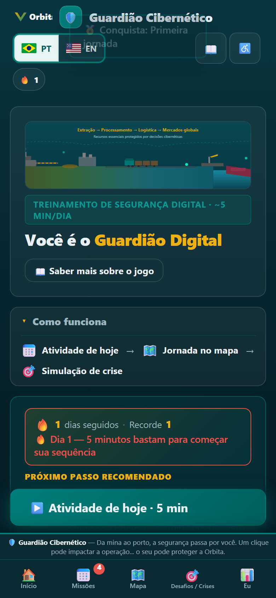
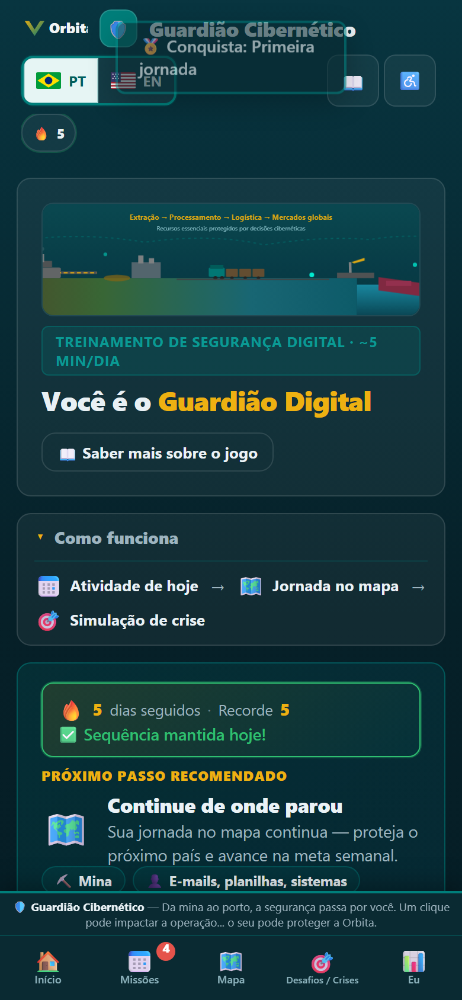
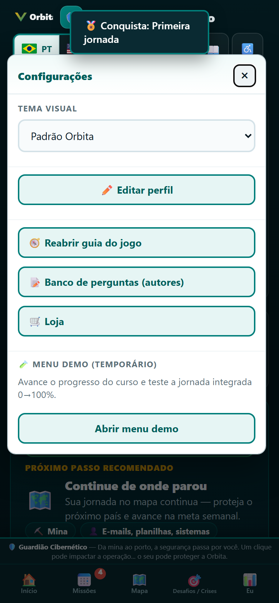
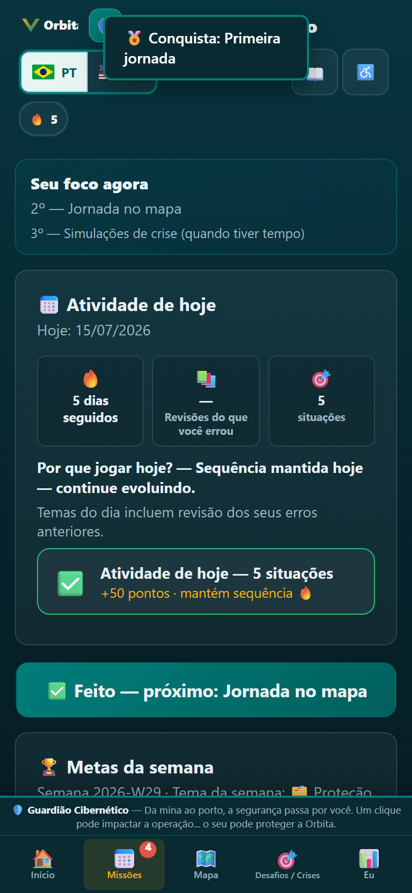
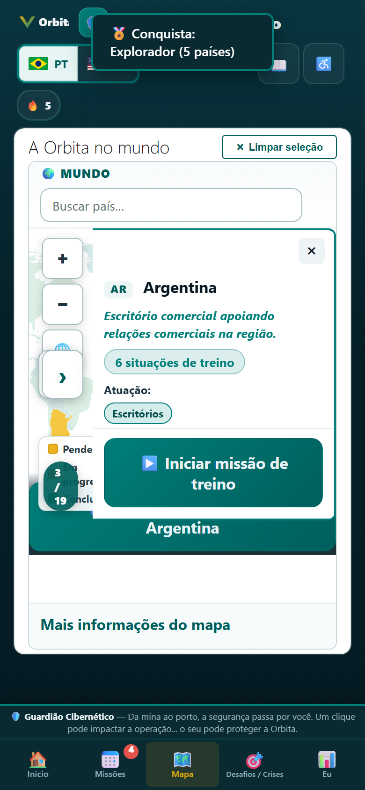
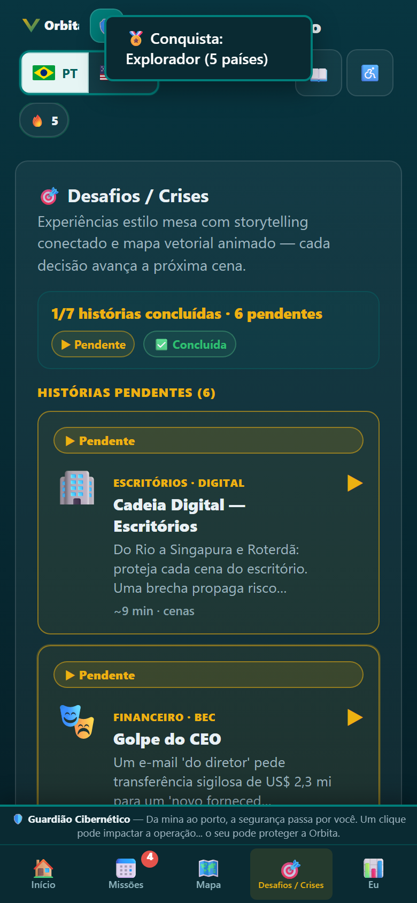
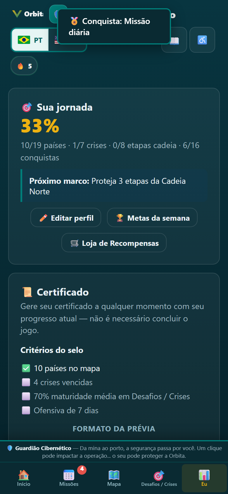
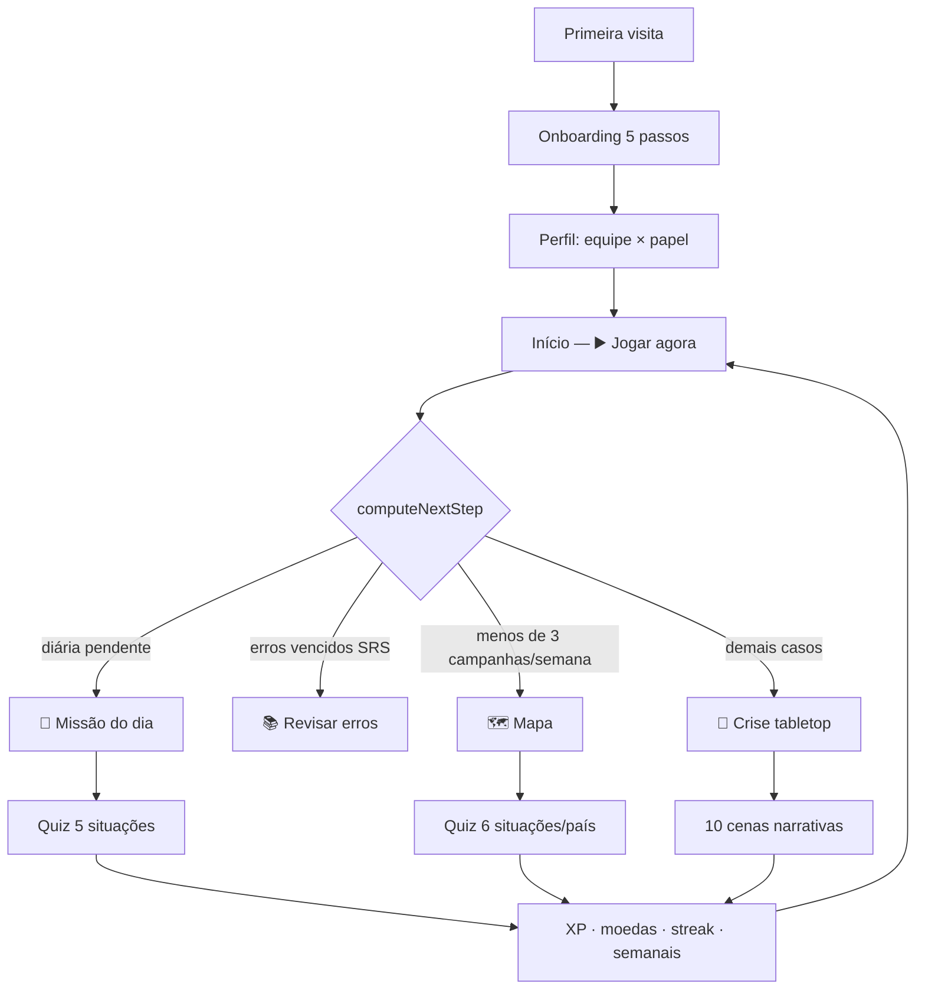

# 🛡️ Guardião Cibernético — Orbita

Jogo web **bilíngue (Português 🇧🇷 / Inglês 🇬🇧)** de conscientização em **Cyber Security e Segurança da Informação**, ambientado nas operações reais da Orbita ao redor do mundo. Funciona 100% no navegador, sem login, com suporte **PWA** (instalável e offline após a primeira visita).

**Versão atual:** `v159` · **Demo ao vivo:** [circulador.github.io/q7k3n8zx2m](https://circulador.github.io/q7k3n8zx2m/?v=159)

---

## 📸 Capturas de tela

Visual mobile (390×844) — presets do menu demo para ilustrar a jornada.

| Início — diária pendente | Início — próximo passo |
|:---:|:---:|
|  |  |
| Streak dia 1, faixa “Como funciona” e **▶️ Atividade de hoje** | Diária concluída → próximo passo aponta para o **mapa** |

| Configurações ⚙️ | Missões (diária + semanais) |
|:---:|:---:|
|  |  |
| Guia, banco de perguntas, loja e perfil — ao lado do ⚙️ | Metas da semana e missão do dia na mesma tela |

| Mapa mundial | Desafios / Crises |
|:---:|:---:|
|  |  |
| Campanhas por país | Tabletop narrativo com storytelling conectado |

| Eu — progresso |
|:---:|
|  |
| XP, radar de temas, conquistas e certificado |

> Para regenerar as imagens: `python scripts/capture-readme-screenshots.py` (requer Playwright + Chromium).

---

## 🎮 Como funciona o jogo

O Guardião é um **hub de treino** — todos os modos alimentam o **mesmo progresso** salvo em `localStorage` (`guardiao_orbita_v7`). O painel central é a aba **Eu** (`screenProfile`).

### Jornada do jogador



1. **Onboarding** — idioma, acessibilidade, tour rápido (5 passos).
2. **Perfil** — equipe + papel em `js/profile-data.js`; a matriz de correlação prioriza perguntas mais relevantes ao seu dia a dia.
3. **Início** — o botão **▶️ Jogar agora** segue a fila inteligente `computeNextStep()` (ver abaixo).
4. **Taskbar** — navegação livre entre Início, Missões, Mapa, Crises e Eu.
5. **Configurações** — guia, loja, banco de autores, tema e demo ficam no menu ⚙️.

### Próximo passo recomendado (`computeNextStep`)

A Home decide automaticamente o que fazer em seguida:

| Prioridade | Condição | Ação |
|:---:|---|---|
| 1 | Diária não concluída hoje | Abre **Missão do dia** (5 situações) |
| 2 | Itens SRS vencidos (`S.missed`) | Abre **Revisar meus erros** (sem penalidade) |
| 3 | Menos de 3 campanhas na meta semanal | Abre o **Mapa** para continuar jornada |
| 4 | Caso contrário | Abre **Desafios / Crises** |

### Modos de jogo e o que cada um atualiza

| Modo | Onde entrar | Conteúdo | Atualiza no progresso |
|---|---|---|---|
| **📅 Missão diária** | Missões ou CTA da Home | 5 situações do banco; prioriza temas fracos + erros SRS | `S.daily`, ofensiva (streak), semanal `correct`, XP |
| **🗺️ Mapa** | Mapa ou CTA da Home | 6 situações aleatórias por país (temas do país + perfil) | `S.done`, `themeStats`, semanal `campaign`, XP, conquistas |
| **⛓️ Cadeia Carajás → China** | Dentro do mapa / storytelling | 2 situações por etapa da cadeia produtiva | `S.chainDone`, `themeStats`, desbloqueios na loja |
| **🎯 Crises (chefões)** | Desafios / Crises | 10 cenas em sequência narrativa; alternativas embaralhadas | `S.bossStats`, resiliência, semanal `boss`, selo do certificado |
| **📚 Revisão guiada** | Eu → “Revisar erros” ou revisão SRS | Reapresenta erros com intervalo 1 → 3 → 7 dias | `S.missed` (repetição espaçada) |
| **🛒 Loja** | Configurações → Loja | Cosméticos e molduras com moedas | `S.coins`, `S.cosmetics` |

### Metas semanais (`WEEKLY`)

Não são um modo separado — **somam enquanto você joga**:

| Meta | Meta | Incrementa quando |
|---|---|---|
| `correct` | 20 acertos | Qualquer acerto (mapa, cadeia, diária, crise) |
| `campaign` | 3 jornadas | Termina campanha de um país no mapa |
| `boss` | 1 crise | Conclui uma simulação tabletop |
| `theme` | 8 do tema da semana | Acertos no tema em rotação automática |

Ao completar uma meta: **+40 XP** e toast de conquista semanal.

### Missão diária — montagem inteligente (`buildDaily`)

- Até **2 perguntas** de erros com revisão SRS vencida.
- Até **2 perguntas** dos **temas mais fracos** no radar (`weakThemes`).
- Completa com perguntas do banco geral, priorizando score de perfil (`questionProfileScore`).
- Alternativas **embaralhadas** a cada exibição (anti-decorar).

### Ponte corporativo ↔ pessoal

Cada pergunta do banco traz campo **`personal`** (PT/EN): um paralelo da vida do colaborador (SMS de entrega, Wi-Fi de shopping…). Na tela de quiz aparece como **“💡 Na sua vida”** — o jogador aprende o **princípio**, não a letra da política.

### Hub de progresso (aba Eu)

| Métrica | Alimentada por |
|---|---|
| XP / Nível / Moedas | Acertos em qualquer modo |
| Países concluídos | Campanhas no mapa |
| Radar de temas | Todos os quizzes (`themeStats`) |
| Ofensiva (streak) | Diária, campanha vencida, crise concluída |
| Conquistas (16) | Marcos cruzados (países, crises, XP, streak…) |
| Certificado | Snapshot + selo de resiliência operacional |
| Gestor (piloto) | Dados reais deste dispositivo por equipe |

Documentação detalhada: [`docs/CONEXAO-MODOS.md`](docs/CONEXAO-MODOS.md) · [`RACIONAL-PEDAGOGICO.md`](RACIONAL-PEDAGOGICO.md)

---

## 🧭 Navegação (v159)

**Barra inferior (5 itens):**

`Início` → `Missões` → `Mapa` → `Desafios / Crises` → `Eu`

**Barra superior:** idioma · ofensiva · progresso · 📖 glossário · ♿ acessibilidade · ⚙️ configurações

**Dentro de ⚙️ Configurações:**

- ✏️ Editar perfil
- 🧭 Reabrir guia do jogo
- 📝 Banco de perguntas (autores)
- 🛒 Loja
- Tema, acessibilidade, modo simples, painel do gestor, menu demo

> A **Loja** e o **Guia** saíram da taskbar inferior — ficam apenas em Configurações.

---

## ✨ Destaques desta versão

### Perfil escalável (equipe × papel)

Configuração centralizada em **`js/profile-data.js`** — novas equipes e papéis sem alterar `game.js`.

**Equipes (10):** Mina · Ferrovia · Porto · Corporativo · TI & Segurança · Automação (OT) · Logística · Energia · Projetos & Engenharia · Sustentabilidade

**Papéis (8):** Administrativo · Operação/Campo · Automação (OT) · Liderança · Analista · Técnico · Terceiros · Em formação

### Home mobile-first (UX v2)

- CTA principal, metas semanais em chips, próxima conquista e contexto social por área
- **Sticky CTA** no mobile quando a diária está pendente
- Faixa **“Como funciona”** recolhível nos primeiros dias
- Rollback de interface legada: `?ux=122` ou toggle em Configurações

### Acessibilidade

Narração por voz, alto contraste, texto grande, redução de animações, Libras/ASL (VLibras + ASL), leitura fácil, modo simples e catálogo a11y em Configurações.

### 🧪 Menu demo (QA)

Em **Configurações → Menu demo** — presets **0% → 100%** para testar a jornada integrada, atalhos de estado e “ir para tela”.

---

## 📂 Estrutura do projeto

```
.
├── index.html              # Telas, topbar, taskbar inferior, PWA
├── manifest.webmanifest
├── sw.js                   # Service Worker (cache v159)
├── README.md
├── RACIONAL-PEDAGOGICO.md
├── docs/
│   ├── CONEXAO-MODOS.md    # Como os modos se conectam
│   └── screenshots/        # Prints deste README
├── scripts/
│   └── capture-readme-screenshots.py
├── review.html             # Banco de revisão (legado; revisão também in-app)
├── test_a11y.py
├── test-a11y.mjs
├── assets/
│   ├── orbita-logo.svg
│   ├── countries-110m.json
│   ├── d3.min.js
│   └── topojson-client.min.js
├── css/
│   └── styles.css
├── icons/                  # PWA (192 / 512)
└── js/
    ├── game.js             # Jogo, i18n, navegação, certificado, gestor…
    ├── profile-data.js     # Equipes, papéis, correlação (escalável)
    ├── orbita-world-map.js # Mapa mundial (D3/TopoJSON)
    ├── bosses-data.js      # Crises / storytelling
    ├── boss-maps.js        # SVG animado da cadeia
    ├── questions-data.js   # Banco principal (diária + campanhas)
    ├── country-questions-data.js
    ├── review-bank.js      # Banco de autores in-app
    ├── access-gate.js      # Trava piloto (client-side)
    └── demo-menu.js        # Menu demo temporário (QA)
```

> Versão de cache: `window.APP_VERSION` em `index.html` e `CACHE_VERSION` em `sw.js` (atualmente **159**). Ao publicar, altere ambos e use `?v=159` na URL.

---

## ▶️ Como executar

### Servidor local (recomendado)

```powershell
cd GuardiaoDigitalVale
python -m http.server 8093
```

Abra **[http://localhost:8093/?v=159](http://localhost:8093/?v=159)**.

### GitHub Pages

Deploy automático na branch `main`: [circulador.github.io/q7k3n8zx2m/?v=159](https://circulador.github.io/q7k3n8zx2m/?v=159)

### Testar integração (demo)

1. Abra o jogo → **⚙️ Configurações → Menu demo**.
2. Aplique presets **0% → 25% → 50% → 75% → 100%** e confira o painel de status + CTA da Home.
3. Use **Ir para tela** para validar mapa, missões, crises, loja e gestor.

---

## 🧪 Testes de acessibilidade

| Script | Comando | Porta |
|--------|---------|-------|
| Python | `python test_a11y.py` | 8095 |
| Node   | `node test-a11y.mjs`  | 8094 |

**Pré-requisito:** Playwright com Chromium.

---

## 🌍 Publicar nova versão

1. Atualize `window.APP_VERSION` em `index.html`, query `?v=` nos assets, `CACHE_VERSION` e `PRECACHE` em `sw.js`, e ícones em `manifest.webmanifest`.
2. Atualize este `README.md` (versão, URLs, destaques e screenshots se a UI mudou).
3. Commit e push para `main`.
4. Aguarde o GitHub Pages (1–2 min) e acesse com `?v=XX` para evitar cache antigo do Service Worker.

---

## 🔒 Aviso

Ferramenta **educativa interna**. O mapa e as operações referenciam informações públicas da Orbita. O certificado é ilustrativo e **não substitui certificações oficiais**. Siga sempre as políticas oficiais de segurança da Orbita.
